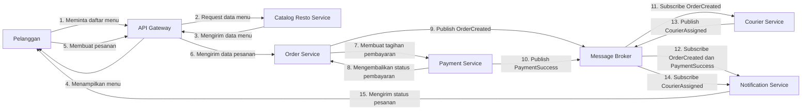
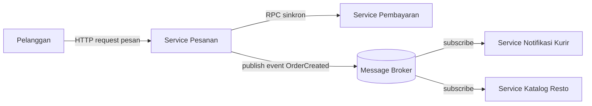

# Tugas 2 (Pekan 2) — Perancangan Arsitektur untuk FoodGo

**Materi terkait:** Architectural style (Layered, SOA, Peer-to-Peer, Publish-Subscribe).

## Studi Kasus

Melanjutkan Tugas 1: FoodGo butuh sistem yang **decoupled** agar tim kurir dan tim resto tidak saling mengganggu ketika salah satu modul diperbarui/deploy ulang. Saat ini semua modul (pesanan, pembayaran, notifikasi kurir, katalog resto) berjalan sebagai satu aplikasi monolitik — sekali deploy, semua modul ikut restart dan berisiko downtime total.

## Tugas Kelompok

1. Pilih **satu** gaya arsitektur utama: **Service-Oriented Architecture (SOA)** atau **Publish-Subscribe**. Boleh dikombinasikan (mis. SOA untuk service inti + Pub-Sub untuk notifikasi), tapi harus dijustifikasi kenapa kombinasi ini yang dipilih. 
**Jawab :** KOMBINASI (SOA + Pub-Sub) dengan pembagian peran seperti berikut : 
**A. SOA (Request-Response Sinkron) untuk Service Inti Transaksi:**
- **Area Implementasi:** Komunikasi antara *Client (Pelanggan)*, *Service Pesanan*, *Service Katalog Resto*, dan *Service Pembayaran*. Proses validasi menu dan eksekusi pembayaran menuntut konsistensi data seketika (*immediate consistency*) dan umpan balik langsung (*immediate feedback*) ke layar pengguna. Pelanggan harus segera mengetahui kepastian apakah saldo/metode pembayaran berhasil dipotong dan pesanan tervalidasi

**B. Publish-Subscribe (Event-Driven Asinkron) untuk Koordinasi Multi-Service & Background Tasks:**
- **Area Implementasi:** Distribusi event pasca-pembayaran. Setelah pembayaran sukses, Service Pesanan tidak perlu menunggu restoran selesai memasak atau kurir ditugaskan (*non-blocking*), jadi Service Pesanan cukup mem-publish event `OrderPaid` ke broker dan langsung bebas melayani transaksi pengguna lain tanpa tertahan waktu tunggu resto/kurir dan Service Pesanan tidak perlu tahu alamat atau status modul resto dan kurir. Tim resto maupun kurir dapat melakukan pembaruan kode, deploy ulang, atau scale-up secara independen tanpa saling mengganggu atau memicu downtime di sistem utama FoodGo

2. Gambarkan minimal 4 komponen berikut dan interaksinya: modul Pesanan, modul Pembayaran, modul Kurir/Notifikasi, modul Katalog Resto (dan message broker/API gateway jika relevan)

**Komponen yang Digunakan dalam Rancangan FoodGo**
1. API Gateway
2. Order Service / Service Pesanan
3. Payment Service / Service Pembayaran
4. Catalog Resto Service / Service Katalog Resto
5. Courier Service / Service Kurir
6. Notification Service / Service Notifikasi
7. Message Broker
8. Fungsi Masing-Masing Komponen

**API Gateway**
Menjadi pintu masuk permintaan dari pelanggan dan meneruskan permintaan tersebut ke service yang sesuai, seperti permintaan melihat menu dan membuat pesanan.

**Order Service**
Menangani proses pembuatan pesanan dan meneruskan permintaan pembayaran ke Payment Service. Setelah itu, Order Service mempublikasikan event OrderCreated melalui Message Broker.

**Payment Service**
Menangani proses pembayaran dan mengembalikan status pembayaran kepada Order Service. Setelah pembayaran berhasil, service ini mempublikasikan event PaymentSuccess melalui Message Broker.

**Catalog Resto Service**
Menyediakan informasi menu yang diminta oleh pelanggan melalui API Gateway, seperti daftar menu yang tersedia.

**Courier Service**
Menerima event OrderCreated melalui Message Broker untuk memproses penugasan kurir. Setelah kurir ditugaskan, service ini mempublikasikan event CourierAssigned.

**Notification Service**
Menerima event dari Message Broker, seperti OrderCreated, PaymentSuccess, dan CourierAssigned, kemudian mengirimkan informasi status pesanan kepada pelanggan.

**Message Broker**
Menjadi perantara komunikasi berbasis event antar-service menggunakan pola Publish-Subscribe. Service yang membutuhkan informasi dapat menerima event dengan melakukan subscribe tanpa harus dipanggil secara langsung oleh service lain.

### Diagram Komponen dan Interaksi



**Keterangan Interaksi**
- Langkah 1-8 merupakan komunikasi sinkron, yaitu pelanggan meminta menu, membuat pesanan, dan melakukan pembayaran melalui API Gateway, Order Service, dan Payment Service.
- Langkah 9-14 merupakan komunikasi asinkron menggunakan Message Broker dengan pola Publish-Subscribe.
- Langkah 9, Order Service mempublikasikan OrderCreated.
- Langkah 10, Payment Service mempublikasikan PaymentSuccess.
- Langkah 11, Courier Service melakukan subscribe terhadap event OrderCreated.
- Langkah 12, Notification Service melakukan subscribe terhadap event OrderCreated dan PaymentSuccess.
- Langkah 13, Courier Service mempublikasikan CourierAssigned.
- Langkah 14, Notification Service menerima event CourierAssigned.
- Langkah 15, Notification Service mengirimkan informasi status pesanan kepada pelanggan.

3. Jelaskan alur satu skenario penuh secara end-to-end di diagram (misalnya: pelanggan buat pesanan → bayar → resto terima notifikasi → kurir ditugaskan) — tunjukkan komponen mana berkomunikasi dengan siapa, dan **jenis komunikasinya** (sinkron/asinkron, request-response/event).
**Jawab** : Untuk bagian ini kita memakai satu skenario yang konkret : Pelanggan membuat pesanan, melakukan pembayaran, restoran menerima pesanan, lalu kurir mendapatkan tugas pengantaran. Alurnya perlu buat memperlihatkan urutan komunikasi, termasuk layanan yang nunggu respons dan layanan yang memproses event secara asinkron.
A. Urutan Proses : Proses diawali saat pelanggan order lewat Service Pesanan, di mana sistem bakal validasi menu sama harga ke Service Katalog Resto dan meneruskan transaksi ke Service Pembayaran. Pas pembayaran sukses, Service Pesanan memperbarui status pesanan lalu mentrigger event OrderPaid ke Service Resto. Setelah restoran selesai masak dan kirim sinyal OrderReady, Service Kurir bakal dapet tugas buat jemput makanan, dan di saat yang sama Service Notifikasi bakal ngasih tahu semua pembaruan ini ke pelanggan.
B. Diagram urutan Komunikasi : Supaya urutan proses bisa dipahami , kami memberikan Sequence Diagram untuk bahan diagram end-to-end ( ada di folder diagram) 

4. Analisis tertulis: kenapa gaya ini mengatasi masalah *coupling* dari Tugas 1, dan apa trade-off-nya (mis. Pub-Sub menambah kompleksitas debugging karena alur tidak linear).
**Jawab** :  Pada Tugas 1, semua modul berada di satu proses monolitik dan berebut memori/koneksi DB, sehingga kegagalan satu fungsi menumbangkan seluruh sistem. Dengan SOA, modul Pesanan, Pembayaran, Katalog, dan Kurir dipisah menjadi service mandiri dengan alokasi resource masing-masing. Tim kurir dan tim resto dapat memperbarui dan men-deploy modul mereka secara independen tanpa memicu restart atau downtime pada Service Pesanan, jadi untuk **memutus Resource & Deployment Coupling**. 
Disisi lain, **Pub-Sub mengatasi Coupling Temporal** modul pesanan menggantung tanpa batas waktu karena menunggu respons modul lain. Pada arsitektur baru, komunikasi sinkron hanya dipertahankan untuk transaksi kritis (Katalog dan Pembayaran) dengan menerapkan batas waktu (*timeout*). Untuk proses selanjutnya (Restoran, Kurir, dan Notifikasi), sistem beralih ke Pub-Sub asinkron. Service Pesanan cukup menerbitkan event `OrderPaid` ke Message Broker lalu selesai, tanpa perlu menunggu restoran selesai memasak atau kurir ditugaskan

trade off nya, karena alur komunikasi terputus di Message Broker dan berjalan asinkron, penelusuran error (*debugging*) menjadi lebih sulit dibandingkan alur monolitik linear. Sistem membutuhkan implementasi *Correlation ID* dan *Distributed Tracing* untuk memantau status pesanan lintas service, jadi kompleksitas debugging dan tracing. kemudian konsistensi data bertahap, jadi status pesanan tidak langsung serentak ter-update di seluruh sistem pada detik yang sama (*eventual consistency*). Jika terjadi kegagalan di sisi hilir (misalnya restoran menolak pesanan setelah status `OrderPaid` terbit), sistem membutuhkan mekanisme kompensasi transaksi

## Cara Membuat Diagram (Gratis, Cukup Laptop)

Tidak perlu software berbayar. Dua opsi:

**Opsi A — Mermaid di dalam Markdown (disarankan).** Ditulis sebagai teks biasa di `README.md`, otomatis dirender jadi diagram oleh GitHub — tidak perlu install apa pun.

````markdown

````

**Opsi B — draw.io / diagrams.net** (gratis, jalan di browser tanpa akun, atau app desktop offline di [app.diagrams.net](https://app.diagrams.net/)). Ekspor sebagai `.png` dan simpan di folder `diagram/`.

## Struktur Submission

```
tugas-02-perancangan-arsitektur/
├── README.md          # Analisis + diagram Mermaid (jika Opsi A) atau referensi ke diagram/
├── JURNAL.md
└── diagram/            # File .png/.drawio jika pakai Opsi B
```

## Rubrik Penilaian (Tugas 2)

| Komponen | Bobot | Kriteria |
|---|---|---|
| Ketepatan pemilihan gaya arsitektur | 20% | Justifikasi SOA/Pub-Sub sesuai kebutuhan *decoupling* di skenario |
| Kelengkapan & kejelasan diagram | 30% | Semua komponen kunci ada, jenis komunikasi (sinkron/asinkron) jelas ditandai |
| Analisis trade-off | 30% | Bukan hanya kelebihan — kekurangan/kompleksitas baru juga dibahas |
| Proses & kontribusi kelompok | 20% | `JURNAL.md`, commit history |

## Batasan Penggunaan AI (Level 2)

Kebijakan **Level 2 (AI Assisted Idea Generation & Structuring)** berlaku — lihat [`../RUBRIK-UMUM.md`](../RUBRIK-UMUM.md). Boleh memakai AI untuk brainstorming komponen apa saja yang umum ada di gaya arsitektur SOA/Pub-Sub; **tidak boleh** meminta AI menggambar diagram final atau menuliskan analisis trade-off yang tinggal ditempel. Catat pemakaian AI di "Log Penggunaan AI" pada `JURNAL.md`.

- Diagram Mermaid/draw.io yang "terlalu generik" (identik dengan contoh tutorial di internet tanpa penyesuaian ke kasus FoodGo) akan dinilai rendah pada komponen kelengkapan & kejelasan diagram.
